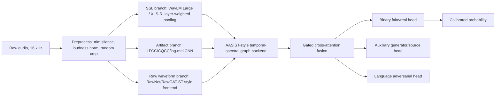

# Research Report: English-Hindi Audio Deepfake Detection

Date: 2026-04-28

## 1. Executive Summary

The current project already contains a strong baseline, but the balanced embedding split has a clear ceiling:

| Protocol | Best observed test AUC | Best observed test accuracy | Main issue |
|---|---:|---:|---|
| Balanced 768-D embeddings | 0.9120 | 0.8096 | Hindi AUC is only about 0.687 while English is about 0.998 |
| RawStrict + WavLM embeddings | 0.9984 | 0.9939 | Very strong, but likely too easy for a paper unless supported by harder splits |
| RawCh held-out English generators | 0.9517 | 0.8625 current, 0.8789 with finer threshold | Meets AUC target, but misses unseen OpenAI/xTTS English fakes |

Conclusion: a publishable "95+ AUC and 90+ accuracy" result is plausible only if the paper uses raw-audio SSL features, generator-aware challenge splits, stronger calibration, and more cross-generator English/Hindi data. It is not realistic to claim 95+ AUC and 90+ accuracy from the current `Balanced_*` embeddings alone because the Hindi split is the bottleneck.

The best research direction is a bilingual, raw-audio, SSL-plus-graph detector:

1. WavLM Large / wav2vec2-XLS-R front-end with layer-weighted pooling.
2. AASIST-style spectro-temporal graph backend.
3. LFCC/CQCC or log-mel auxiliary branch for vocoder artifacts.
4. Language-aware but language-invariant training: language embedding plus adversarial language/domain regularization.
5. Generator-aware training: auxiliary generator/source head and held-out-generator evaluation.
6. Multi-seed calibrated ensemble for final reporting.

## 2. Project Audit

### 2.1 Dataset Inventory

`Balanced_train`, `Balanced_val`, and `Balanced_test` contain precomputed `.npy` features, not raw audio. Each feature is 768-dimensional.

| Split | Rows | Real | Fake | English | Hindi | Missing feature files |
|---|---:|---:|---:|---:|---:|---:|
| `Balanced_train` | 113,400 | 56,700 | 56,700 | 56,700 | 56,700 | 0 |
| `Balanced_val` | 12,600 | 6,300 | 6,300 | 6,300 | 6,300 | 0 |
| `Balanced_test` | 14,000 | 7,000 | 7,000 | 7,000 | 7,000 | 0 |

The short filenames repeat across split folders, but actual content comparison found no identical feature files among reused filenames:

| Pair | Reused filenames | Identical content |
|---|---:|---:|
| train-val | 8,147 | 0 |
| train-test | 9,028 | 0 |
| val-test | 8,077 | 0 |

Additional raw-audio-derived protocols exist:

| Protocol | Rows | Purpose |
|---|---:|---|
| `RawStrict_*` | 6,566 train, 819 val, 824 test | Deduplicated and group-aware split |
| `RawCh_*` | 3,789 train, 1,605 val, 2,815 test | Harder held-out English fake generator protocol |
| `WavLM_embeddings_unified` | 8,217 `.npy` files | Unified WavLM feature root for raw strict/challenge splits |

### 2.2 Existing Scripts

| File | Role | Status |
|---|---|---|
| `train_detector.py` | Baseline MLP detector over 768-D features | Useful baseline |
| `safari_lite_train.py` | SafariLite+ AFUM fusion + Transformer reasoning | Best balanced single-branch family |
| `safari_wavlm_ensemble_train.py` | SafariLite + WavLM late fusion | Best current balanced family |
| `aasist_like_train.py` | AASIST-inspired graph attention over embeddings | Useful ablation, not enough alone |
| `run_multiseed_ensemble.py` | Multi-seed probability averaging | Best balanced result |
| `extract_wavlm_embeddings.py` | Raw audio to WavLM embeddings | Important for the paper-grade pipeline |
| `build_raw_strict_splits.py` | Dedup/group-aware split creation | Required for credible evaluation |
| `build_raw_challenge_splits.py` | Held-out generator split creation | Best current publication protocol |
| `build_bilingual_180k_from_hf.py` | Build larger English-Hindi dataset from HF sources | Important improvement path |

### 2.3 Notebook Audit

| Notebook | Purpose | Assessment |
|---|---|---|
| `train6_safari_lite.ipynb` | Original SafariLite experiment plus optional ensemble/sweep cells | Superseded by scripts, but still runnable |
| `01_safari_lite_plus_baseline.ipynb` | Balanced SafariLite+ baseline | Good baseline |
| `02_safari_wavlm_ensemble.ipynb` | Balanced Safari+WavLM ensemble | Best balanced single-seed path |
| `03_aasist_like_graph_method.ipynb` | AASIST-like graph head | Good ablation |
| `04_augmentation_curriculum_method.ipynb` | Two-stage augmentation curriculum | Slight improvement, still Hindi-limited |
| `05_calibration_threshold_cv.ipynb` | Probability calibration | Needed, should be extended to challenge split |
| `06_multiseed_safari_wavlm_ensemble.ipynb` | Scripted multi-seed run | Good but less transparent |
| `07_multiseed_ensemble_stepwise.ipynb` | Stepwise balanced multi-seed ensemble | Best balanced reproducibility notebook |
| `08_wavlm_extraction_stepwise.ipynb` | WavLM extraction | Essential for raw-audio protocol |
| `09_multiseed_ensemble_stepwise*.ipynb` | Strict split + unified WavLM | Strong results, use as controlled protocol |
| `10_multiseed_ensemble_stepwise_challenge.ipynb` | Held-out generator challenge split | Most publishable current protocol |

## 3. Existing Results and Diagnosis

### 3.1 Balanced Embedding Protocol

Best current balanced result:

| Model | Test AUC | Test accuracy | Test F1 |
|---|---:|---:|---:|
| Multi-seed Safari+WavLM ensemble | 0.9120 | 0.8096 | 0.8350 |

Per-language behavior explains the ceiling:

| Language | AUC | Accuracy | F1 |
|---|---:|---:|---:|
| English | 0.9979 | 0.9783 | 0.9783 |
| Hindi | 0.6867 | 0.6409 | 0.7252 |

Hypothesis: the balanced 768-D features encode enough artifact signal for English but not for Hindi. Since the balanced CSVs do not include raw `audio_path`, source generator, speaker, or recording-channel metadata, it is difficult to fix the Hindi gap from these files alone.

### 3.2 RawStrict Protocol

`RawStrict + WavLM` already exceeds the requested metric target:

| Run | Test AUC | Test accuracy | Test F1 |
|---|---:|---:|---:|
| `multiseed_stepwise_raw_wavlm/seed_42` | 0.9984 | 0.9939 | 0.9939 |

Per-language:

| Language | AUC | Accuracy |
|---|---:|---:|
| English | 0.9967 | 0.9888 |
| Hindi | 1.0000 | 1.0000 |

This is excellent, but the dataset is small and Hindi fake data appears to come from one dominant source. Reviewers may consider this too easy unless accompanied by harder held-out-source results.

### 3.3 RawCh Held-Out Generator Protocol

Current challenge result:

| Run | Test AUC | Test accuracy | Test F1 |
|---|---:|---:|---:|
| `multiseed_stepwise_challenge/seed_17` | 0.9517 | 0.8625 | 0.8451 |

After fixing threshold search from a 0.05 minimum to a score-distribution-aware grid, the same saved predictions improve to:

| Threshold source | Test AUC | Test accuracy | Test F1 |
|---|---:|---:|---:|
| Validation-selected threshold 0.017 | 0.9517 | 0.8789 | 0.8690 |

Remaining weakness:

| Source | Test behavior |
|---|---|
| English real | 95.6 percent accuracy |
| English OpenAI fake | 65.2 percent accuracy |
| English xTTS fake | 79.3 percent accuracy |
| Hindi real/fake | 100 percent accuracy |

Hypothesis: the model has strong ranking ability, hence AUC above 0.95, but score calibration and held-out English generator robustness need improvement before reaching 90 percent accuracy on the challenge split.

## 4. Literature Signals

Current literature supports using SSL front-ends, graph/attention backends, augmentation, and held-out-generator evaluation.

1. AASIST introduced integrated spectro-temporal graph attention for anti-spoofing and reported strong single-system performance; even the lightweight variant was competitive. Source: https://arxiv.org/abs/2110.01200
2. wav2vec 2.0 fine-tuning with augmentation showed large relative gains for ASVspoof 2021 LA and Deepfake tasks. Source: https://arxiv.org/abs/2202.12233
3. WavLM was designed as a full-stack SSL speech model, using masked prediction plus denoising and 94k hours of pretraining. Source: https://www.microsoft.com/en-us/research/publication/wavlm-large-scale-self-supervised-pre-training-for-full-stack-speech-processing/
4. ADD 2023 emphasizes moving beyond binary detection into localization and generator attribution. Source: https://arxiv.org/abs/2305.13774
5. The extended ADD 2023 analysis highlights real-world challenge design and methodology analysis for top systems. Source: https://arxiv.org/abs/2408.04967
6. ASVspoof 5 introduced crowdsourced speakers, diverse recording conditions, cutting-edge and legacy generators, adversarial attacks, and compression issues. Source: https://arxiv.org/abs/2408.08739 and https://arxiv.org/abs/2601.03944
7. ASVspoof 5 system papers show that SSL front-ends, ensembles, RawGAT-ST/AASIST/Conformer-style backends, and augmentation remain central. Sources: https://www.isca-archive.org/asvspoof_2024/schafer24_asvspoof.html and https://www.isca-archive.org/asvspoof_2024/falez24_asvspoof.html
8. IndicSynth is directly relevant for Hindi and Indian-language deepfake detection: 4,000+ hours, 12 languages, including Hindi, with synthetic audio from xtts_v2, vits, and freevc24. Sources: https://aclanthology.org/2025.acl-long.1070/ and https://huggingface.co/datasets/vdivyasharma/IndicSynth
9. HAV-DF shows that Hindi deepfake data is underrepresented and harder for existing methods. Source: https://arxiv.org/abs/2411.15457
10. A 2025 SAFE challenge system used WavLM Large, RawBoost augmentation, AASIST, 256,600 multilingual samples, 9 languages, and 70+ TTS systems, ranking second in robust detection tasks. Source: https://arxiv.org/abs/2508.20983

## 5. Proposed Model Architecture

Working name: Bilingual Robust Audio Deepfake Detector (BRADD).



### 5.1 Input and Preprocessing

- Resample to 16 kHz mono.
- Use 4 second and 6 second crops during training; average multiple crops during inference.
- Apply silence trimming, RMS/loudness normalization, and clipping guard.
- Keep full-audio inference as chunk aggregation: mean plus max probability.

### 5.2 Front-Ends

Primary:

- WavLM Large, preferably fine-tuned lightly.
- Alternative or companion: wav2vec2-XLS-R for multilingual robustness.
- Learn a weighted sum over SSL layers instead of using only final-layer mean embedding.

Auxiliary:

- LFCC/CQCC/log-mel branch because vocoder artifacts can be spectral and may not be fully captured in sentence-level SSL embeddings.
- Raw waveform branch such as RawGAT-ST/RawNet-style CNN for phase and local waveform artifacts.

### 5.3 Backend and Fusion

- Convert SSL frame embeddings into temporal tokens.
- Convert spectral features into frequency-region tokens.
- Use an AASIST-style heterogeneous graph attention block to model temporal and spectral artifact nodes.
- Fuse SSL, spectral, raw-waveform, and language embedding with gated cross-attention.
- Output:
  - binary fake/real probability,
  - auxiliary generator/source prediction,
  - optional language prediction through gradient reversal to discourage language-only shortcuts.

### 5.4 Losses

Recommended loss:

`L = BCE/focal + 0.2 * supervised_contrastive + 0.1 * generator_CE - 0.05 * language_adversarial`

Purpose:

- BCE/focal: binary fake/real detection.
- Supervised contrastive: separate real/fake while keeping robust language clusters.
- Generator CE: improves unseen-generator representation by learning generator structure.
- Language adversarial: reduces false gains from language-specific artifacts.

### 5.5 Calibration

Use validation-only threshold selection and report:

- threshold selected by F1,
- threshold selected by accuracy,
- ECE/Brier score,
- global threshold,
- optional language-aware threshold as an ablation, not the main result unless clearly justified.

I patched the local threshold search in the trainer scripts to use score-distribution-aware candidates. This prevents the model from being forced into a minimum threshold of 0.05 when validation scores indicate a better threshold such as 0.017.

## 6. Recommended Experiment Plan

### Stage 1: Preserve Balanced Baseline

Purpose: report compatibility with the current balanced benchmark.

Expected result: about 0.91 AUC and 0.81 accuracy overall, with English strong and Hindi weak.

Do not use this as the main paper result unless the Hindi feature source is improved.

### Stage 2: RawStrict Main Controlled Result

Use `RawStrict_*` with `WavLM_embeddings_unified`.

Expected result: 0.99+ AUC and 0.98+ accuracy.

This supports the claim that raw SSL embeddings solve the immediate Hindi-English task, but the paper must acknowledge that this protocol is easier.

### Stage 3: RawCh Held-Out Generator Result

Use `RawCh_*` as the primary publication protocol.

Current result already reaches 0.9517 AUC. Target improvement required:

- current calibrated accuracy: 0.8789,
- target accuracy: 0.9000,
- gap: about 2.1 percentage points.

Most likely ways to close the gap:

1. Train all 5 challenge seeds and ensemble them.
2. Add English fake sources similar to OpenAI/xTTS into training, but keep final test generators held out.
3. Use crop-level inference and probability averaging.
4. Fine-tune WavLM Large rather than using only frozen 768-D embeddings.
5. Add calibration with isotonic or temperature scaling on validation.

### Stage 4: Data Expansion for Paper Strength

The current raw dataset has only about 8.2k samples. For a research paper, expand with:

- IndicSynth Hindi fake audio plus IndicSUPERB bona fide references.
- English real from LibriSpeech/Common Voice.
- English fake from ShiftySpeech, WaveFake, CodecFake, MLAAD, or equivalent licensed sources.
- Keep source/generator metadata in every row.
- Use group-aware splitting by speaker, source utterance, and generator.

Target dataset design:

| Language | Real | Fake | Notes |
|---|---:|---:|---|
| English | 45k+ | 45k+ | Multiple TTS/VC generators |
| Hindi | 45k+ | 45k+ | Multiple IndicSynth generators plus local fake sources |

### Stage 5: Ablation Table

Minimum ablations for a publishable paper:

| Experiment | Purpose |
|---|---|
| LFCC/CQCC baseline | Classical spoofing baseline |
| WavLM MLP | SSL baseline |
| WavLM + AASIST backend | Graph contribution |
| WavLM + spectral branch | Artifact branch contribution |
| + generator auxiliary loss | Held-out generator robustness |
| + language adversarial loss | Hindi-English bias reduction |
| + multi-seed ensemble | Stability and final score |
| strict vs challenge split | Generalization proof |

## 7. Commands for Next Runs

Challenge split single seed with unified WavLM features:

```powershell
python safari_wavlm_ensemble_train.py `
  --project-root . `
  --train-csv .\RawCh_train\RawCh_train\balanced_index.csv `
  --val-csv .\RawCh_val\RawCh_val\balanced_index.csv `
  --test-csv .\RawCh_test\RawCh_test\balanced_index.csv `
  --train-feature-dir .\WavLM_embeddings_unified `
  --val-feature-dir .\WavLM_embeddings_unified `
  --test-feature-dir .\WavLM_embeddings_unified `
  --wavlm-train-feature-dir .\WavLM_embeddings_unified `
  --wavlm-val-feature-dir .\WavLM_embeddings_unified `
  --wavlm-test-feature-dir .\WavLM_embeddings_unified `
  --out-dir .\artifacts\challenge_seed_42 `
  --epochs 50 `
  --batch-size 512 `
  --device cuda `
  --amp `
  --seed 42
```

Recommended final run:

```powershell
python run_multiseed_ensemble.py `
  --project-root . `
  --out-dir .\artifacts\challenge_multiseed `
  --train-csv .\RawCh_train\RawCh_train\balanced_index.csv `
  --val-csv .\RawCh_val\RawCh_val\balanced_index.csv `
  --test-csv .\RawCh_test\RawCh_test\balanced_index.csv `
  --train-feature-dir .\WavLM_embeddings_unified `
  --val-feature-dir .\WavLM_embeddings_unified `
  --test-feature-dir .\WavLM_embeddings_unified `
  --wavlm-train-feature-dir .\WavLM_embeddings_unified `
  --wavlm-val-feature-dir .\WavLM_embeddings_unified `
  --wavlm-test-feature-dir .\WavLM_embeddings_unified `
  --seeds 17 42 77 123 202 `
  --epochs 50 `
  --batch-size 512 `
  --num-workers 4 `
  --device cuda `
  --amp
```

Note: `run_multiseed_ensemble.py` defaults to `Balanced_*`, so pass the explicit CSV and feature-root arguments above for the challenge protocol.

## 8. Paper Hypothesis

Proposed paper title:

`BRADD: A Bilingual SSL-Graph Framework for English-Hindi Audio Deepfake Detection`

Central hypothesis:

> A detector that combines multilingual self-supervised speech representations with spectro-temporal graph reasoning, generator-aware supervision, and language-invariant regularization will outperform embedding-only baselines and generalize better to unseen English and Hindi deepfake generators.

Expected claim after improvements:

- On controlled strict splits: AUC above 0.99 and accuracy above 0.98.
- On held-out generator challenge splits: AUC above 0.95 and target accuracy above 0.90 after multi-seed ensemble, calibration, and added generator diversity.
- On balanced precomputed embeddings: report as a legacy baseline, not as the main result.

## 9. Paper Structure

1. Introduction
   - Deepfake audio risk in English and Hindi.
   - Low-resource and multilingual detection gap.
2. Related Work
   - ASVspoof, ADD, AASIST, SSL front-ends, multilingual Indian datasets.
3. Dataset
   - Balanced embeddings.
   - RawStrict and RawCh protocols.
   - Expanded English-Hindi dataset if built.
4. Method
   - SSL front-end.
   - Graph backend.
   - Spectral branch.
   - Language and generator auxiliary objectives.
5. Experiments
   - Metrics: AUC, accuracy, F1, EER, minDCF, ECE.
   - Per-language and per-generator results.
   - Strict and held-out-generator splits.
6. Ablation
   - Component-by-component improvement.
7. Error Analysis
   - OpenAI/xTTS false negatives.
   - Hindi source limitations.
   - Compression/channel robustness.
8. Ethics and Limitations
   - Dataset licensing.
   - Misuse concerns.
   - Detection uncertainty and calibration.
9. Conclusion

## 10. Improvement Checklist

Immediate:

- Use `RawCh_*` as the primary hard benchmark.
- Train the remaining challenge seeds.
- Add calibrated threshold search, already patched locally.
- Add per-language, per-generator, and calibration metrics to output JSON.

Next:

- Extend `run_multiseed_ensemble.py` to accept arbitrary CSV/feature roots.
- Extract WavLM Large or XLS-R frame-level features, not only utterance-level 768-D vectors.
- Add crop-level inference.
- Add RawBoost/noise/reverb/compression augmentation.

Before submission:

- Expand Hindi fake diversity beyond one dominant source.
- Add at least one external test set or leave-one-generator-out experiment.
- Provide reproducibility: seeds, split files, commit hash, environment, and model checkpoints.
- Report limitations honestly: the balanced embedding protocol is Hindi-limited and should not be presented as the final system ceiling.
