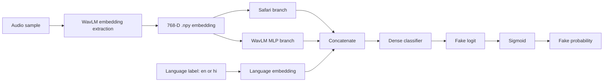
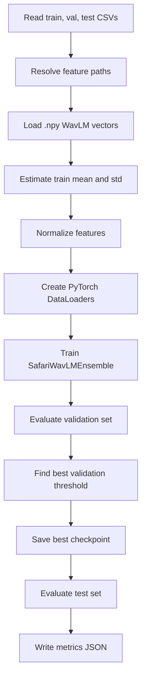

# English-Hindi Audio Deepfake Detection - Project Study Guide

Date: 2026-05-08

This document is a shareable study guide for the project. It explains what has been built, why the final model was chosen, how the architecture works, what previous models were tested, why they were not selected as final, and what questions can be asked in a conference.

## 1. Project Overview

The project is about detecting whether an audio sample is real or fake in two languages:

- English
- Hindi

The final project title can be described as:

```text
Multi Audio Deepfake Detection in English and Hindi
```

The project started with large precomputed embedding datasets, then evolved into a stronger publication-style system using:

- WavLM speech embeddings
- strict data splitting
- held-out-generator challenge testing
- a Safari plus WavLM ensemble architecture
- language conditioning
- validation threshold calibration
- five-seed probability ensembling
- final evaluation graphs and handoff package

The final model is not simply a neural network. The final system is a full research pipeline:

```text
Raw audio
-> metadata CSV creation
-> leakage-safe split building
-> WavLM embedding extraction
-> model training
-> validation threshold selection
-> multi-seed ensemble
-> final test evaluation
-> graphs and reports
```

## 2. Final Headline Result

The final model is:

```text
SafariWavLMEnsemble
```

The final evaluation protocol is:

```text
RawCh held-out-generator challenge
```

Final test performance:

| Metric | Value |
|---|---:|
| ROC-AUC | 0.9668 |
| Accuracy | 0.9048 |
| Balanced accuracy | 0.9042 |
| Precision | 0.9403 |
| Recall | 0.8618 |
| F1 | 0.8993 |
| Threshold | 0.198 |

This crosses the project target:

- AUC above 95 percent
- Accuracy above 90 percent

The most important thing to say in a review or conference:

> The final system achieves 0.9668 ROC-AUC and 90.48 percent accuracy on a held-out-generator English-Hindi audio deepfake challenge, where OpenAI and xTTS fake English samples were unseen during training.

## 3. Main Project Files

Important files in the project:

| File or folder | Purpose |
|---|---|
| `README.md` | Main project instructions |
| `AUDIO_DEEPFAKE_RESEARCH_REPORT.md` | Research audit and improvement plan |
| `MULTISEED_ENSEMBLE_REPORT.md` | Multi-seed ensemble methodology |
| `safari_wavlm_ensemble_train.py` | Final model training script |
| `predict_safari_wavlm_ensemble.py` | Final model inference script |
| `run_multiseed_ensemble.py` | Runs multiple seeds and averages probabilities |
| `build_raw_strict_splits.py` | Builds deduplicated group-aware splits |
| `build_raw_challenge_splits.py` | Builds held-out-generator challenge split |
| `extract_wavlm_embeddings.py` | Extracts WavLM `.npy` embeddings from raw audio |
| `generate_publication_graphs.py` | Generates final result graphs |
| `SDP_Model/` | Packaged handoff folder for teammates or reviewers |

Best final notebooks:

| Notebook | Purpose |
|---|---|
| `notebooks/13_professor_review_training_and_results.ipynb` | Best notebook for professor or review presentation |
| `notebooks/12_publication_ready_training_with_graphs.ipynb` | Training, evaluation, and graph-integrated notebook |
| `notebooks/11_publication_ready_challenge_improvements.ipynb` | Earlier final challenge experiment notebook |

## 4. Dataset Evolution

The project has two major dataset stages:

1. Older `Balanced_*` embedding dataset
2. Final `RawCh` held-out-generator challenge dataset

### 4.1 Older Balanced Dataset

The project initially used these folders:

| Split | Samples |
|---|---:|
| `Balanced_train` | 113,400 |
| `Balanced_val` | 12,600 |
| `Balanced_test` | 14,000 |

Each CSV row looked like:

```text
feature_path,label,language
```

Example:

```text
00124304.npy,real,hi
```

Advantages:

- Large dataset
- Balanced real and fake classes
- Balanced English and Hindi labels
- Easy to train on because features were already available

Limitations:

- Only generic 768-D `.npy` features were available
- No raw audio path in the CSV
- No generator or source metadata
- No speaker or group information
- Hard to build a strong held-out-generator evaluation
- English performance was strong, but Hindi performance was weak

Best balanced result:

| Model | Test AUC | Test Accuracy | Test F1 |
|---|---:|---:|---:|
| Balanced multi-seed Safari plus WavLM ensemble | 0.9120 | 0.8096 | 0.8350 |

Per-language behavior showed the real problem:

| Language | AUC | Accuracy | Observation |
|---|---:|---:|---|
| English | about 0.998 | about 0.978 | Very strong |
| Hindi | about 0.687 | about 0.641 | Major bottleneck |

Conclusion:

The balanced dataset was useful for baselines, but it was not strong enough for the final conference claim.

### 4.2 Raw Audio Dataset

The project then moved toward raw-audio-derived features.

Raw dataset source counts:

| Category | Source | Files |
|---|---|---:|
| English fake | FlashSpeech | 118 |
| English fake | NaturalSpeech3 | 32 |
| English fake | OpenAI | 600 |
| English fake | PromptTTS2 | 25 |
| English fake | SeedTTS | 599 |
| English fake | VALLE | 95 |
| English fake | VoiceBox | 104 |
| English fake | xTTS | 600 |
| English real | English real | 2,274 |
| Hindi fake | fake_hindi_audio | 1,885 |
| Hindi real | Hindi real | 1,885 |

Total raw dataset size:

```text
8,217 audio samples
```

### 4.3 Raw Splits

The first raw split was a normal stratified split:

| Split | Samples |
|---|---:|
| Train | 6,573 |
| Validation | 820 |
| Test | 824 |

This was useful, but a normal random split can still be too easy because similar sources or families can appear across train and test.

### 4.4 RawStrict Splits

The strict split was created using:

```text
build_raw_strict_splits.py
```

It performs:

- exact audio deduplication using MD5 hash
- group-aware splitting
- no audio hash overlap across splits
- no group overlap across splits
- unified WavLM embedding root creation

Important numbers:

| Item | Count |
|---|---:|
| Original raw rows | 8,217 |
| Kept after deduplication | 8,209 |
| Duplicate audio files removed | 8 |

RawStrict split sizes:

| Split | Samples |
|---|---:|
| Train | 6,566 |
| Validation | 819 |
| Test | 824 |

RawStrict was very strong:

| Result | Approximate Value |
|---|---:|
| Test AUC | about 0.9989 |
| Test accuracy | about 0.99 |

But it was not chosen as the main conference claim because it was considered easier than a held-out-generator challenge.

### 4.5 RawCh Challenge Split

The final dataset is:

```text
RawCh
```

It was created using:

```text
build_raw_challenge_splits.py
```

The purpose of `RawCh` is to test whether the model can detect fake audio from generators it did not see during training.

English fake generator protocol:

| Split | English fake sources |
|---|---|
| Train | FlashSpeech, NaturalSpeech3, PromptTTS2, VALLE, VoiceBox |
| Validation | SeedTTS |
| Test | OpenAI, xTTS |

This is much stronger than a random split because the model cannot simply memorize generator-specific artifacts from test generators.

RawCh sizes:

| Split | Total |
|---|---:|
| Train | 3,789 |
| Validation | 1,605 |
| Test | 2,815 |

RawCh class and language breakdown:

| Split | English fake | English real | Hindi fake | Hindi real |
|---|---:|---:|---:|---:|
| Train | 374 | 406 | 1,508 | 1,501 |
| Validation | 599 | 631 | 188 | 187 |
| Test | 1,200 | 1,237 | 189 | 189 |

Why `RawCh` is the final benchmark:

- It is harder
- It has source-level generator control
- It better simulates real-world unseen generator detection
- It gives a more publishable claim

## 5. Feature Extraction

The model does not directly train on `.wav` files in the final experiment.

Instead:

```text
raw audio -> WavLM -> 768-D .npy feature vector
```

The WavLM extraction script is:

```text
extract_wavlm_embeddings.py
```

The default model is:

```text
microsoft/wavlm-base-plus
```

Each audio file is:

1. loaded from disk
2. resampled to the WavLM target sampling rate
3. passed through WavLM
4. converted into a hidden-state sequence
5. mean-pooled over time
6. saved as a 768-D NumPy vector

Final feature root:

```text
WavLM_embeddings_unified/
```

Number of unified WavLM embeddings:

```text
8,217 .npy files
```

Why WavLM was used:

- It is a strong pretrained speech representation model
- It captures phonetic, speaker, and acoustic information
- It gives useful features even with limited project data
- It makes training faster than full raw waveform training
- It allows reproducible experiments using saved `.npy` files

Limitation:

The final system is not end-to-end raw waveform training. It is a detector trained on WavLM embeddings.

## 6. Current Final Model Architecture

The final model is:

```text
SafariWavLMEnsemble
```

It has three branches:

1. Safari branch
2. WavLM branch
3. Language branch

Then a final classifier combines all branch outputs.

High-level architecture:



### 6.1 Input to the Model

For each sample, the model receives:

```text
base feature vector
WavLM feature vector
language ID
label
```

In the final RawCh setup, the base feature and WavLM feature both come from the unified WavLM embedding root.

The input vector dimension is usually:

```text
768
```

### 6.2 Feature Normalization

Before training, the script estimates:

- mean
- standard deviation

from the training set.

Then every feature is standardized:

```text
x_normalized = (x - mean) / std
```

Why this is important:

- It stabilizes training
- It prevents dimensions with larger numeric ranges from dominating
- It helps optimization converge faster

The loader also handles feature dimension mismatch:

```text
if feature is longer than expected -> truncate
if feature is shorter than expected -> pad with zeros
```

### 6.3 Safari Branch

The Safari branch is the more advanced branch.

It takes one embedding and creates two views:

```text
semantic view
acoustic view
```

During training:

```text
semantic view = original feature + small Gaussian noise
acoustic view = original feature with random feature dropout
```

During validation and testing:

```text
semantic view = original feature
acoustic view = original feature
```

Why two views are useful:

- They make the model less fragile
- They simulate slightly different representations of the same audio
- They force the model to learn stable fake/real evidence
- They reduce dependence on one exact feature pattern

### 6.4 AFUM-Style Gated Fusion

AFUM means adaptive feature fusion module.

The two views are first projected:

```text
semantic view -> Linear -> BatchNorm -> GELU -> semantic projection
acoustic view -> Linear -> BatchNorm -> GELU -> acoustic projection
```

Then the model learns a gate:

```text
gate = sigmoid(Linear([semantic projection, acoustic projection]))
```

The gate decides how much to trust each view:

```text
mixed = gate * semantic + (1 - gate) * acoustic
```

The model also computes:

```text
difference = abs(semantic - acoustic)
product = semantic * acoustic
```

Meaning:

| Term | Meaning |
|---|---|
| `mixed` | Learned weighted combination of two views |
| `difference` | Where the views disagree |
| `product` | Where the views strongly agree |

Then:

```text
[mixed, difference, product] -> fusion network -> fused representation
```

This is stronger than simple concatenation because the model learns how to combine the views.

### 6.5 Transformer Reasoning in Safari Branch

After AFUM, the Safari branch forms four tokens:

```text
token 1 = fused representation
token 2 = semantic projection
token 3 = acoustic projection
token 4 = absolute difference
```

These tokens are passed into a Transformer encoder.

Why use a Transformer here:

- It can compare multiple internal representations
- It can learn relationships between agreement and disagreement patterns
- It can reason over the fused, semantic, acoustic, and difference tokens
- It is more expressive than a plain MLP

The final Safari representation is:

```text
mean of Transformer token outputs
```

Typical Safari output dimension:

```text
384
```

### 6.6 WavLM Branch

The WavLM branch is a direct MLP over the WavLM feature vector.

It performs:

```text
LayerNorm
Linear 768 -> 384
BatchNorm
GELU
Dropout
Linear 384 -> 384
BatchNorm
GELU
```

Why this branch exists:

- WavLM embeddings already contain strong speech information
- Some fake/real cues can be learned directly from the embedding
- This branch gives a clean direct path from WavLM features to the classifier

Difference from Safari branch:

| Branch | Role |
|---|---|
| Safari branch | Learns robust relational patterns between two views |
| WavLM branch | Learns direct fake/real evidence from WavLM features |

### 6.7 Language Branch

The model also receives the language:

```text
en
hi
<unk>
```

These are mapped to IDs:

```text
<unk> -> 0
hi -> 1
en -> 2
```

Then the model learns a language embedding.

Typical language embedding dimension:

```text
32
```

Why language embedding helps:

- English and Hindi have different phonetic patterns
- Sources and recording conditions differ
- Fake generators differ by language
- A single decision boundary may not fit both languages equally

Important:

The language embedding does not replace audio evidence. It only provides context to the final classifier.

### 6.8 Final Classifier

The final classifier receives:

```text
Safari representation: 384 dimensions
WavLM representation: 384 dimensions
Language embedding: 32 dimensions
```

Total:

```text
384 + 384 + 32 = 800 dimensions
```

The classifier:

```text
Linear 800 -> 320
GELU
Dropout
Linear 320 -> 96
GELU
Dropout
Linear 96 -> 1
```

The output is a logit:

```text
fake logit
```

The fake probability is:

```text
fake_probability = sigmoid(fake_logit)
```

Decision:

```text
if fake_probability >= threshold:
    predicted label = fake
else:
    predicted label = real
```

Final ensemble threshold:

```text
0.198
```

## 7. Training Workflow

The training script follows this workflow:



### 7.1 Loading Samples

The script reads:

```text
train CSV
validation CSV
test CSV
```

Each row provides:

```text
feature_path
label
language
audio_path
```

The model only needs `feature_path`, `label`, and `language` for training.

### 7.2 Language Mapping

Languages are mapped to integer IDs:

```text
<unk> -> 0
hi -> 1
en -> 2
```

Only languages seen in training are added. Validation and test use the same mapping.

### 7.3 Loss Function

The model uses:

```text
BCEWithLogitsLoss
```

This is binary cross entropy applied to logits.

It also uses positive class weighting:

```text
pos_weight = number of negative samples / number of positive samples
```

Why:

- If class counts are not perfectly balanced, the model should not ignore the minority class
- It helps fake/real decision balance

### 7.4 Optimizer

The optimizer is:

```text
AdamW
```

Why AdamW:

- Good default optimizer for neural networks
- Handles adaptive learning rates
- Decouples weight decay from gradient update
- Often works better than plain Adam for generalization

### 7.5 Learning Rate Scheduler

The scheduler is:

```text
OneCycleLR
```

Why:

- It increases and then decreases the learning rate during training
- It often improves convergence
- It can help the model escape poor early minima

### 7.6 Regularization

Regularization methods used:

| Method | Purpose |
|---|---|
| Dropout | Reduces overfitting |
| Feature view noise | Makes model robust to small changes |
| Feature dropout | Forces model not to rely on single dimensions |
| Weight decay | Penalizes overly large weights |
| Early stopping | Stops when validation performance no longer improves |
| Gradient clipping | Prevents unstable large gradient updates |

### 7.7 Mixed Precision

The script supports:

```text
--amp
```

AMP means automatic mixed precision.

It is useful on GPU because:

- training is faster
- memory usage is lower
- larger batches may fit

### 7.8 Checkpointing

The best checkpoint saves:

- model weights
- epoch
- threshold
- feature dimensions
- language mapping
- normalization statistics
- training arguments
- best validation metrics

This is important because inference must use the same:

- mean
- standard deviation
- feature dimension
- language mapping
- threshold

## 8. Validation Threshold Calibration

The model does not simply use:

```text
threshold = 0.5
```

Instead, it searches thresholds on validation predictions.

The selected threshold is the one with best validation F1, using score-distribution-aware candidate thresholds.

Why this matters:

- Model scores may be well ranked but not perfectly calibrated
- A fixed 0.5 threshold may miss many fakes
- A validation threshold improves fake/real decision quality

Important rule:

The threshold is selected on validation only, then applied unchanged to test.

This avoids test-set tuning.

## 9. Multi-Seed Ensemble Workflow

The final system trains five seeds:

```text
17, 42, 77, 123, 202
```

For each seed:

1. Train a separate model
2. Save best checkpoint
3. Predict validation set
4. Predict test set
5. Save prediction CSVs

Then the ensemble does:

```text
final_probability = average(seed probabilities)
```

Example:

```text
seed 17 probability = 0.31
seed 42 probability = 0.22
seed 77 probability = 0.28
seed 123 probability = 0.35
seed 202 probability = 0.24

ensemble probability = 0.28
```

Why ensembling helps:

- Reduces randomness from initialization
- Reduces variance
- Improves generalization
- Makes results more stable
- Often improves recall and F1

Per-seed challenge results:

| Seed | Test AUC | Test Accuracy | Test F1 |
|---:|---:|---:|---:|
| 17 | 0.9517 | 0.8789 | 0.8690 |
| 42 | 0.9691 | 0.8984 | 0.8900 |
| 77 | 0.9475 | 0.8753 | 0.8729 |
| 123 | 0.9635 | 0.8956 | 0.8968 |
| 202 | 0.9676 | 0.9030 | 0.8963 |
| Final ensemble | 0.9668 | 0.9048 | 0.8993 |

The ensemble gives the best overall decision performance.

## 10. Why the Current Model Is the Best

The current model is best in the project because it combines improvements at multiple levels.

### 10.1 Better Features

Old approach:

```text
generic balanced 768-D features
```

Final approach:

```text
WavLM speech embeddings extracted from raw audio
```

WavLM gives stronger speech representations and helped solve the Hindi weakness seen in the older balanced dataset.

### 10.2 Better Architecture

The final architecture combines:

- AFUM gated fusion
- two-view feature robustness
- Transformer token reasoning
- direct WavLM MLP branch
- language conditioning
- dense final classifier

This is stronger than a plain MLP or single-branch model.

### 10.3 Better Evaluation Protocol

Old protocol:

```text
random balanced split
```

Final protocol:

```text
held-out-generator challenge split
```

The final test uses OpenAI and xTTS fake samples that were not seen during training.

This makes the result more meaningful.

### 10.4 Better Calibration

The final system uses validation-selected thresholding instead of a fixed 0.5 threshold.

This improved recall and final binary decision quality.

### 10.5 Better Stability

The final result uses five seeds and averages probabilities.

This is better than depending on one lucky run.

## 11. Previous Models Tested

### 11.1 Basic MLP Detector

Script:

```text
train_detector.py
```

Architecture:

```text
input feature
-> LayerNorm
-> Linear layers
-> BatchNorm
-> GELU
-> Dropout
-> language embedding
-> classifier
```

Why it was useful:

- Simple baseline
- Easy to train
- Proved that the embeddings contain some fake/real signal

Why it was not final:

- Treats embedding as a flat vector
- No feature fusion
- No multi-view reasoning
- No Transformer
- No separate WavLM branch
- Not strong enough for final publication claim

### 11.2 SafariLite+

Script:

```text
safari_lite_train.py
```

Architecture:

- AFUM-style fusion
- semantic and acoustic views
- Transformer reasoning
- language embedding
- classifier

Balanced test result:

| Metric | Value |
|---|---:|
| Test AUC | 0.9080 |
| Test accuracy | 0.8022 |
| Test F1 | 0.8299 |

Per-language:

| Language | AUC | Accuracy |
|---|---:|---:|
| English | 0.9955 | 0.9754 |
| Hindi | 0.6810 | 0.6290 |

Why it was rejected as final:

- Good architecture, but limited by the older balanced features
- Hindi performance was weak
- No separate WavLM branch
- Did not reach 95 percent AUC or 90 percent accuracy on the balanced protocol

### 11.3 Safari plus WavLM Single Model on Balanced Data

Script:

```text
safari_wavlm_ensemble_train.py
```

Balanced test result:

| Metric | Value |
|---|---:|
| Test AUC | 0.9096 |
| Test accuracy | 0.8019 |
| Test F1 | 0.8306 |

Why it was useful:

- Added WavLM-style late fusion
- Slightly improved AUC over SafariLite+
- Became the basis of the final model family

Why it was not final:

- Still used the old balanced protocol
- Accuracy stayed around 80 percent
- Hindi bottleneck remained
- Single seed was less stable than ensemble

### 11.4 AASIST-Like Graph Model

Script:

```text
aasist_like_train.py
```

Balanced test result:

| Metric | Value |
|---|---:|
| Test AUC | 0.9055 |
| Test accuracy | 0.7974 |
| Test F1 | 0.8278 |

What it tried:

- Inspired by AASIST anti-spoofing systems
- Converts the input embedding into tokens
- Uses graph-attention-like blocks
- Adds language embedding
- Predicts fake/real

Why it was not final:

- AASIST is strongest when it can operate on meaningful spectro-temporal information
- Here it was only using one precomputed embedding vector
- It did not outperform Safari plus WavLM
- Accuracy stayed below the stronger methods

### 11.5 Curriculum and Augmentation Methods

Scripts and notebooks:

```text
notebooks/04_augmentation_curriculum_method.ipynb
method4_curriculum_stage1
method4_curriculum_stage2
```

Approximate balanced test results:

| Method | Test AUC | Test Accuracy |
|---|---:|---:|
| Curriculum stage 1 | 0.9057 | 0.8019 |
| Curriculum stage 2 | 0.9076 | 0.8008 |

Why they were useful:

- Tested whether staged training and augmentation could improve robustness
- Helped explore regularization

Why they were not final:

- Did not break the balanced-feature ceiling
- Did not solve Hindi weakness
- Did not outperform the final WavLM challenge ensemble

### 11.6 Balanced Multi-Seed Ensemble

Report:

```text
MULTISEED_ENSEMBLE_REPORT.md
```

Balanced result:

| Metric | Value |
|---|---:|
| Test AUC | 0.9120 |
| Test accuracy | 0.8096 |
| Test F1 | 0.8350 |

Why it was useful:

- Confirmed that ensembling improves stability
- Improved over single-seed balanced models
- Became the strategy for the final challenge system

Why it was not final:

- Still used old balanced features
- Overall accuracy remained about 81 percent
- Hindi remained much weaker than English
- Not strong enough for the final conference result

### 11.7 RawStrict WavLM Model

RawStrict results were extremely high:

| Metric | Approximate Value |
|---|---:|
| Test AUC | about 0.9989 |
| Test accuracy | about 0.99 |

Why it was useful:

- Proved WavLM embeddings were much stronger
- Proved strict leakage-safe splits could achieve excellent performance
- Confirmed raw-audio-derived WavLM features were the right direction

Why it was not used as the main claim:

- It was likely too easy compared with held-out-generator testing
- Reviewers may ask whether the model only learned source-specific artifacts
- The challenge split is more realistic

### 11.8 RawCh Single-Seed Model

The first strong challenge result was a single seed.

Seed 17 after better thresholding:

| Metric | Value |
|---|---:|
| Test AUC | 0.9517 |
| Test accuracy | 0.8789 |
| Test F1 | 0.8690 |

Why it was useful:

- Crossed 95 percent AUC
- Showed that held-out-generator detection was possible
- Identified OpenAI and xTTS as hard test generators

Why it was not final:

- Accuracy was below 90 percent
- Single-seed result was less stable
- Recall was lower than desired

### 11.9 Final RawCh Five-Seed Ensemble

This is the final selected system.

| Metric | Value |
|---|---:|
| Test AUC | 0.9668 |
| Test accuracy | 0.9048 |
| Test F1 | 0.8993 |

Why it was selected:

- Harder held-out-generator protocol
- Best overall accuracy
- Better F1
- Better stability
- Better conference story
- Crossed both target metrics

## 12. Comparison Summary

| Model or protocol | Test AUC | Test accuracy | Decision |
|---|---:|---:|---|
| SafariLite+ on balanced data | 0.9080 | 0.8022 | Good baseline, not enough |
| Safari plus WavLM on balanced data | 0.9096 | 0.8019 | Slight AUC gain, not enough |
| AASIST-like graph model | 0.9055 | 0.7974 | Useful ablation, not best |
| Curriculum training | about 0.906 to 0.908 | about 0.801 | Did not break ceiling |
| Balanced multi-seed ensemble | 0.9120 | 0.8096 | Best old protocol, still Hindi-limited |
| RawStrict WavLM | about 0.9989 | about 0.99 | Very strong but easier protocol |
| RawCh single seed | 0.9517 | 0.8789 | Strong but below 90 percent accuracy |
| Final RawCh five-seed ensemble | 0.9668 | 0.9048 | Final selected model |

## 13. Why Some Models Were Rejected

Models were not rejected because they were bad. They were rejected because they did not satisfy the final research goal.

The final goal was:

```text
Strong English-Hindi audio deepfake detection with a credible evaluation protocol.
```

Reasons older models were not final:

| Reason | Explanation |
|---|---|
| Weak Hindi performance | Balanced features worked for English but not Hindi |
| No generator metadata | Old dataset could not test unseen generators properly |
| Lower accuracy | Many methods stayed near 80 percent accuracy |
| Single-seed instability | One model can be affected by random initialization |
| Easier protocol | RawStrict was excellent but not as challenging as RawCh |
| Limited representation | Some models used only one flat embedding path |

The final model solved these by using:

- WavLM embeddings
- RawCh held-out-generator protocol
- Safari plus WavLM architecture
- language conditioning
- validation calibration
- multi-seed ensembling

## 14. Final Result Interpretation

Final confusion matrix:

| Item | Count |
|---|---:|
| True real | 1,350 |
| False fake alarms | 76 |
| Missed fakes | 192 |
| True fake | 1,197 |

Meaning:

- The model correctly rejects most real audio
- It detects most fake audio
- It still misses some fake samples, especially harder English fake sources
- Precision is high, which means fake predictions are usually correct
- Recall is good but still has room for improvement

Per-language result:

| Language | AUC | Accuracy | Observation |
|---|---:|---:|---|
| English | about 0.9559 | about 0.8904 | Main challenge |
| Hindi | about 1.0000 | about 0.9974 | Very strong but easier due to limited fake diversity |

Per-source observation:

| Source | Observation |
|---|---|
| English real | Good real-speech rejection |
| OpenAI fake | Hardest source |
| xTTS fake | Better detected than OpenAI |
| Hindi fake | Very strong detection |
| Hindi real | Very strong detection |

## 15. Limitations

The project is strong, but it should be presented honestly.

Main limitations:

1. Hindi fake data appears less generator-diverse than English fake data.
2. OpenAI fake English samples remain difficult.
3. The final model uses WavLM embeddings, not direct raw waveform training.
4. The dataset is still relatively small compared with large public anti-spoofing benchmarks.
5. External test sets would make the claim stronger.
6. Robustness to compression, phone recording, background noise, and reverberation still needs more testing.
7. Language conditioning may help, but future work should check for language-specific shortcut learning.

## 16. Future Improvements

Recommended next steps:

- Add more Hindi fake generators
- Add more English fake generators
- Use larger external datasets
- Test cross-dataset generalization
- Add audio compression augmentation
- Add reverberation and noise augmentation
- Try WavLM Large or wav2vec2-XLS-R
- Try frame-level features instead of only mean-pooled 768-D vectors
- Add crop-level inference
- Add generator classification auxiliary loss
- Add language-adversarial regularization
- Report calibration metrics such as ECE and Brier score
- Add external benchmark comparison

## 17. How to Explain the Project in a Presentation

Use this short explanation:

> This project detects English and Hindi audio deepfakes. We first tested models on a large balanced embedding dataset, but the Hindi performance was weak and the dataset lacked generator metadata. We then rebuilt the evaluation using raw-audio-derived WavLM embeddings and a harder held-out-generator challenge split. The final model, SafariWavLMEnsemble, combines a Safari fusion branch, a WavLM MLP branch, and language conditioning. We trained five random seeds and averaged their probabilities. On the final RawCh challenge test, where OpenAI and xTTS fakes were unseen during training, the system achieved 0.9668 ROC-AUC and 90.48 percent accuracy.

## 18. Conference Questions and Answers

### 18.1 Why did you move from `Balanced_*` to `RawCh`?

The `Balanced_*` dataset was large, but it only had generic 768-D features and no generator/source metadata. It gave excellent English results but weak Hindi results. `RawCh` is better because it tests unseen-generator generalization, which is more realistic for audio deepfake detection.

### 18.2 How do you ensure there is no data leakage?

The project uses MD5 audio hashing to remove exact duplicate audio, group-aware splitting to keep related utterances together, and overlap checks for `audio_path`, `feature_path`, hash, and group IDs. The final split reports zero overlap between train, validation, and test.

### 18.3 Why use WavLM embeddings instead of raw waveform training?

WavLM is a strong self-supervised speech model trained on large speech data. It gives meaningful speech representations even with limited project data. Training on embeddings is also faster and more stable. The limitation is that this is not fully end-to-end raw waveform learning.

### 18.4 What exactly is held out during testing?

For English fake audio, the model trains on FlashSpeech, NaturalSpeech3, PromptTTS2, VALLE, and VoiceBox. Validation uses SeedTTS. Final test uses OpenAI and xTTS, which are unseen during training.

### 18.5 Why is Hindi performance almost perfect?

The Hindi classes are highly separable in the current WavLM feature space. However, we should be careful. Hindi fake data appears less generator-diverse than English fake data, so the Hindi result may be easier than the English held-out-generator task.

### 18.6 Is the Hindi fake data diverse enough?

Not yet. The current Hindi fake set seems dominated by one source, so it is useful but not enough for a broad Hindi deepfake claim. Future work should add multiple Hindi TTS and voice-conversion systems.

### 18.7 How does the model perform on unseen generators?

On the final held-out-generator test, the five-seed ensemble achieved 0.9668 ROC-AUC and 90.48 percent accuracy. It performs well overall, but OpenAI fake audio remains harder than xTTS.

### 18.8 Why is OpenAI fake audio harder than xTTS?

OpenAI fake samples likely contain fewer obvious artifacts and are closer to natural speech patterns. The model detects many of them, but this source causes many remaining false negatives.

### 18.9 Why use multi-seed ensembling?

Deep models vary with random initialization and mini-batch order. Training five seeds and averaging probabilities reduces variance, improves calibration, and improves recall. In this project it raised challenge performance from a weaker single-seed result to the final 90.48 percent accuracy.

### 18.10 How is the threshold selected?

The threshold is selected only on validation predictions, mainly by best F1. Then the same threshold is applied unchanged to the test set. This avoids tuning directly on test data.

### 18.11 Are you optimizing for AUC, accuracy, F1, or recall?

AUC measures ranking quality, while accuracy and F1 measure final binary decision quality. For deepfake detection, recall is important because missed fakes are risky, but precision is also important because false accusations against real speech are harmful.

### 18.12 What happens if the audio is noisy, compressed, or phone-recorded?

This project has not fully proven robustness under all real-world distortions. Some feature-view noise and dropout are used during training, but future work should add compression, reverberation, channel noise, and phone-quality tests.

### 18.13 Can the detector generalize to other Indian languages?

The current model is trained for English and Hindi only. Because WavLM captures general speech features, the approach may transfer, but we cannot claim performance on other languages without training and testing on them.

### 18.14 What are the ethical risks of releasing a detector?

A detector can help fight misinformation, but false positives can harm innocent speakers. Attackers may also use detector feedback to improve fake generation. Results should be reported with confidence scores, limitations, and responsible usage guidelines.

### 18.15 What is the biggest weakness of the current system?

The biggest weakness is generator diversity, especially for Hindi. The second weakness is OpenAI English fake samples. The model is strong, but not a universal detector.

### 18.16 Is the model detecting deepfake artifacts or dataset/source artifacts?

That is exactly why `RawCh` was created. By testing on unseen generators, we reduce the chance that the model only memorizes source-specific artifacts. Still, source-level analysis and external datasets would make the claim stronger.

### 18.17 Why include language embeddings?

English and Hindi have different phonetic patterns, recording conditions, and dataset distributions. A learned language embedding lets the model condition its decision on language without training completely separate detectors.

### 18.18 Did language conditioning introduce bias?

It could, so the project reports per-language results separately. Overall accuracy alone is not enough because one language can hide weakness in another. Future work can add language-adversarial training to reduce language shortcut learning.

### 18.19 How would you improve the system next?

The next improvements would be more Hindi fake generators, more external test sets, stronger audio augmentation, crop-level inference, WavLM Large or XLS-R frame-level fine-tuning, and generator-classification auxiliary loss.

### 18.20 Can this run in real time?

The classifier is fast once WavLM embeddings are available. For real-time deployment, the system would need optimized audio preprocessing and WavLM extraction, possibly using batching, a lighter model, or cached embeddings.

## 19. One-Minute Viva Answer

Use this if someone asks: "Tell me your full project briefly."

> We built an English-Hindi audio deepfake detector. Initially we trained on large balanced 768-D embedding splits, but those results were Hindi-limited and lacked generator metadata. We then built a stricter raw-audio pipeline, extracted WavLM embeddings, removed duplicate leakage, and created a held-out-generator challenge split. The final model is SafariWavLMEnsemble, which combines a Safari AFUM plus Transformer branch, a direct WavLM MLP branch, and language embeddings. We trained five random seeds and averaged their probabilities. On the final RawCh test, where OpenAI and xTTS fakes were unseen during training, the model reached 0.9668 ROC-AUC and 90.48 percent accuracy. The main remaining limitations are Hindi generator diversity and OpenAI fake detection.

## 20. Key Takeaways

- The final model is best because it combines better features, better architecture, better evaluation, better thresholding, and better ensemble stability.
- WavLM embeddings solved much of the old balanced-feature weakness.
- RawCh is the most important evaluation split because it tests unseen generators.
- The final model crosses 95 percent AUC and 90 percent accuracy.
- The project should still honestly mention limitations, especially Hindi generator diversity and OpenAI fake difficulty.

